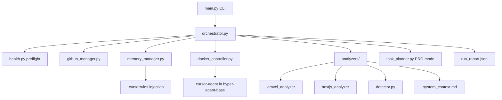

# HyperOrchestrator

Production-ready, self-improving multi-agent orchestration system for automated code tasks across Laravel and Next.js projects.

## Features

- **Framework analysis** — Auto-detects Laravel or Next.js with confidence scoring; writes rich `.system_context.md`
- **Three execution levels** — Fast (minimal fix), Medium (auto-debug + tests), Pro (AI-decomposed multi-step plan)
- **Self-learning memory** — SQLite-backed error/solution patterns with deduplication, relevance scoring, and structured `.cursorrules` injection
- **Docker isolation** — Ephemeral `hyper-agent-base` containers with repo, API key, and SSH mounts
- **Git workflow** — Clone, checkout `staging`, commit, push with retry/backoff and conflict handling
- **Production hardening** — Pre-flight health checks, correlation IDs, JSON logging, run reports, dry-run mode

## Requirements

- Python 3.12+
- Docker daemon running locally
- `hyper-agent-base` Docker image built and available
- Git installed
- Cursor User API key at `/opt/agent-orchestrator/config/agent.env`
- `~/.ssh` configured for Git push (read-only mount into containers, mode 0600 on private keys)
- `OPENAI_API_KEY` environment variable (required for `--level pro`)

## Installation

```bash
cd "/path/to/orchestratore cloud"
python3.12 -m venv .venv
source .venv/bin/activate
pip install -r requirements.txt
pip install -e ".[dev]"   # optional: includes pytest
```

## Docker Base Image

Containers expect a base image named `hyper-agent-base` with `cursor-agent` installed:

```dockerfile
FROM ubuntu:22.04
RUN apt-get update && apt-get install -y git curl nodejs npm php-cli composer
COPY cursor-agent /usr/local/bin/cursor-agent
WORKDIR /workspace
```

```bash
docker build -t hyper-agent-base .
```

## Agent Environment

```bash
sudo mkdir -p /opt/agent-orchestrator/config
echo "CURSOR_API_KEY=your-key-here" | sudo tee /opt/agent-orchestrator/config/agent.env
chmod 600 /opt/agent-orchestrator/config/agent.env
```

Mounted read-only as `/workspace/.env` inside containers.

## Usage

```bash
python -m core.main \
  --repo https://github.com/org/my-laravel-app.git \
  --task "Fix N+1 query on users index" \
  --level medium
```

Or after `pip install -e .`:

```bash
hyper-orchestrator --repo <url> --task "<description>" --level fast
```

### Dry Run

Validate configuration, health checks, and framework analysis without executing agents:

```bash
hyper-orchestrator --repo <url> --task "test" --level pro --dry-run
```

### Execution Levels

| Level | Alias | Behavior |
|-------|-------|----------|
| 1 | `fast`, `l1`, `level1` | `cursor-agent --model composer-2.5`, strict minimal fix, push immediately, no test loop |
| 2 | `medium`, `l2`, `level2` | `--yolo` agent, run tests, auto-debug on failure, push only when tests pass |
| 3 | `pro`, `l3`, `level3` | Master AI decomposes into JSON atomic tasks, sequential fresh containers, validates each step |

### Options

```
--repo          Git repository URL (required)
--task          Task description (required)
--level         1/fast, 2/medium, 3/pro (default: medium)
--work-dir      Local clone path (optional)
--max-retries   Medium-level debug retries (default: 3)
--openai-model  Model for PRO decomposition (default: gpt-4o-mini)
--dry-run       Validate without executing agents
--json-log      Structured JSON logs with correlation IDs
--report-dir    Directory for run summary JSON
-v, --verbose   Debug logging
```

## Architecture



```
core/
├── main.py                 CLI entrypoint
├── orchestrator.py         Level routing, workflow
├── github_manager.py       Clone, staging, push (retry + timeout)
├── docker_controller.py    Ephemeral agent containers
├── memory_manager.py       SQLite learning history
├── models.py               Pydantic schemas
├── exceptions.py           Custom exception hierarchy
├── retry.py                Exponential backoff
├── security.py             URL validation, secret redaction
├── health.py               Pre-flight checks
├── logging_config.py       JSON logs, correlation IDs
├── log_parser.py           Agent success/failure detection
├── task_planner.py         PRO plan validation + ordering
├── context_builder.py      Context window prioritization
├── run_report.py           Run summary artifacts
└── analyzers/
    ├── base_analyzer.py
    ├── detector.py         Framework auto-detection + confidence
    ├── laravel_analyzer.py
    ├── nextjs_analyzer.py
    └── unknown_analyzer.py
```

## Self-Learning

When a Medium or Pro task fails multiple times then succeeds, HyperOrchestrator records error/solution patterns with:

- Deduplication by content hash
- Relevance scoring matched to the current task
- Project-specific vs global patterns (global after 3+ failures)
- Automatic expiry of patterns older than 90 days

Patterns are injected into `.cursorrules` under structured sections before each run.

Data: `~/.hyper-orchestrator/learning_history.db`

## Generated Artifacts

| File | Location | Purpose |
|------|----------|---------|
| `.system_context.md` | Project root | Framework analysis for sub-agents |
| `.cursorrules` | Project root | Injected learned patterns |
| `run-*.json` | `~/.hyper-orchestrator/reports/` | Run summary with correlation ID |

## Troubleshooting

| Symptom | Likely cause | Fix |
|---------|--------------|-----|
| `Docker is unavailable` | Daemon not running | Start Docker Desktop / `sudo systemctl start docker` |
| `Base image not found` | Missing image | `docker build -t hyper-agent-base .` |
| `agent.env not found` | Missing API key file | Create `/opt/agent-orchestrator/config/agent.env` |
| `Git push rejected` | Remote staging diverged | Resolve conflicts manually in work dir, or rebase |
| `OPENAI_API_KEY required` | Missing for PRO level | `export OPENAI_API_KEY=sk-...` |
| SSH push fails in container | Key permissions | `chmod 600 ~/.ssh/id_*` |
| Tests keep failing (medium) | Wrong test command | Check `.system_context.md` Testing section |

Enable verbose JSON logs for production debugging:

```bash
hyper-orchestrator --repo <url> --task "..." --level medium --json-log -v
```

## API Gateway

An optional FastAPI webhook server (`api_gateway.py`) queues orchestration jobs via HTTP and returns immediately while the CLI runs in the background.

```bash
pip install -r requirements.txt
uvicorn api_gateway:app --host 0.0.0.0 --port 8000
```

### Endpoints

| Method | Path | Auth | Description |
|--------|------|------|-------------|
| GET | `/health` | No | Liveness check |
| POST | `/webhook/trigger-task` | Yes | Queue a new orchestration job |
| GET | `/jobs/{job_id}` | Yes | Job status and log tail |

### Authentication

Set `ORCHESTRATOR_API_TOKEN` or `WEBHOOK_TOKEN` in the environment. A dev-only default (`dev-orchestrator-token-change-me`) is used when neither is set — **always override in production**.

Pass the token via:

- `Authorization: Bearer <token>`
- `X-API-Token: <token>`

### Example

```bash
curl -X POST http://localhost:8000/webhook/trigger-task \
  -H "Authorization: Bearer your-token-here" \
  -H "Content-Type: application/json" \
  -d '{
    "repo_url": "https://github.com/org/my-app.git",
    "task": "Fix N+1 query on users index",
    "level": "medium"
  }'
```

Response:

```json
{"job_id": "550e8400-e29b-41d4-a716-446655440000", "status": "queued"}
```

Job logs are written to `~/.hyper-orchestrator/jobs/{job_id}.log`.

### Systemd

Copy `deploy/orchestrator-api.service` to `/etc/systemd/system/`, set `ORCHESTRATOR_API_TOKEN` in `/opt/orch-cloud/.env`, then:

```bash
sudo systemctl daemon-reload
sudo systemctl enable --now orchestrator-api
```

## VPS Deployment Guide

1. **Provision** — Ubuntu 22.04+ VPS with 4GB+ RAM, Docker installed
2. **Clone orchestrator** — `git clone <repo> && cd orchestratore-cloud && pip install -e .`
3. **Build base image** — `docker build -t hyper-agent-base .`
4. **Configure secrets**:
   ```bash
   sudo mkdir -p /opt/agent-orchestrator/config
   echo "CURSOR_API_KEY=..." | sudo tee /opt/agent-orchestrator/config/agent.env
   export OPENAI_API_KEY=sk-...   # add to /etc/environment or .bashrc
   ```
5. **SSH for git push** — Deploy key with `chmod 600`, add to GitHub repo
6. **Run** — Use `tmux` or `systemd` for long PRO runs:
   ```bash
   hyper-orchestrator --repo https://github.com/org/app.git \
     --task "Implement feature X" --level pro --json-log
   ```
7. **Monitor** — Check `~/.hyper-orchestrator/reports/run-*.json` for correlation IDs and outcomes

## Tests

```bash
pip install pytest
pytest tests/ -v
python -m py_compile core/*.py core/analyzers/*.py
```

## License

MIT
