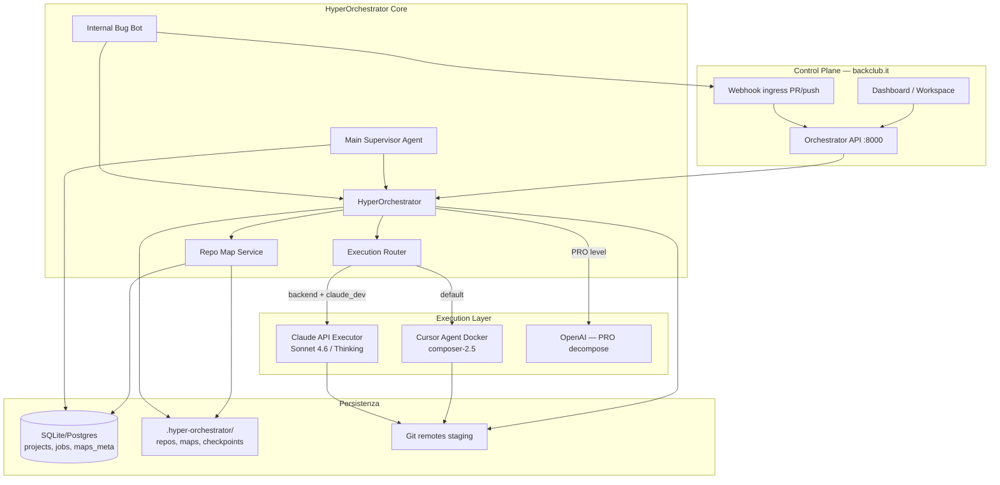
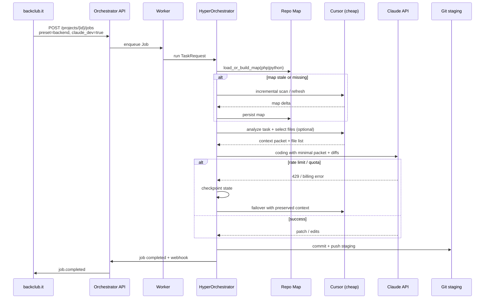
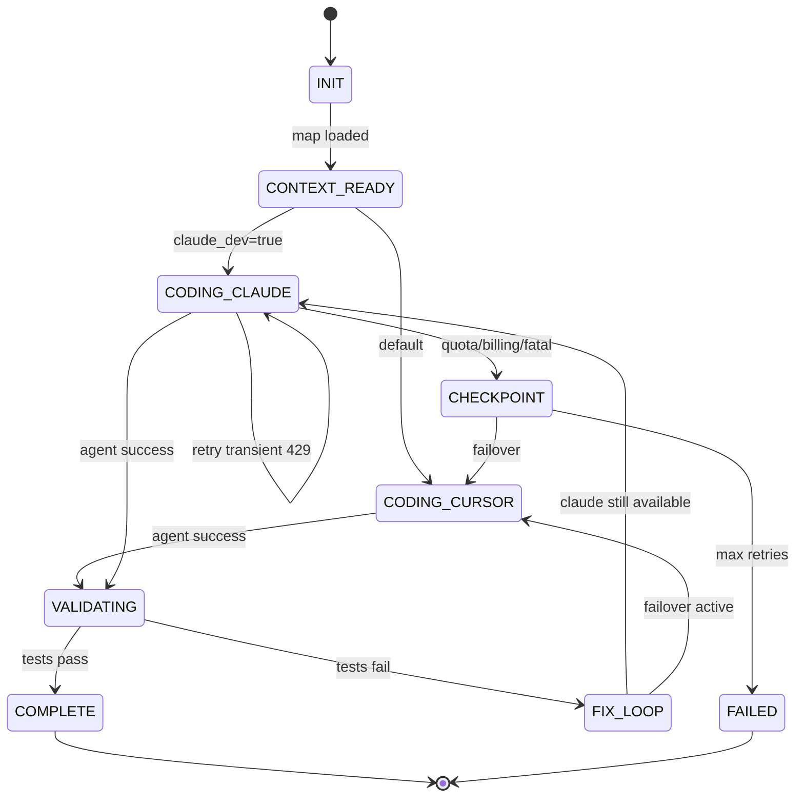

# HyperOrchestrator — Piano Architetturale Multi-Agente Enterprise

**Versione:** 1.0  
**Data:** 7 giugno 2026  
**Stato:** Planning only — nessuna implementazione  
**Target:** Weekend MVP (Backend + opzione Claude API) → Enterprise control plane backclub.it

---

## 1. Executive Summary

HyperOrchestrator oggi è un **motore di esecuzione single-tenant** che: clona un repo, analizza il framework (Laravel/Next.js), genera `.system_context.md`, e lancia **cursor-agent** in container Docker (`composer-2.5`) con preset specializzati (GENERAL, UX, BACKEND, BUGFIX). Il livello PRO decompone i task via OpenAI; il worker FastAPI accoda job e notifica backclub.it via webhook.

La roadmap enterprise introduce **quattro pilastri**:

| Pilastro | Obiettivo |
|----------|-----------|
| **Dual execution mode** | Default Cursor; opzione Backend + "Claude dev" per coding via Anthropic API |
| **Repo context maps** | Mappe strutturate pre-costruite, aggiornamento incrementale, zero full-scan per run |
| **Main Supervisor Agent** | IA dedicata cross-progetto: review, warning, auto-task, non fiducia cieca nei sub-agent |
| **Governance & Bug Bot** | Review pre-push, gate su merge staging, integrazione control plane backclub.it |

**Verità critica su billing:** l'abbonamento **Claude Pro ($20/mo)** è per l'interfaccia web claude.ai e **non sostituisce** l'Anthropic API. Per integrazione programmatica serve una **API key separata** con fatturazione usage-based. Proposta realistica: budget mensile configurabile (es. $30–50), solo le chiamate di coding su Claude, orchestrazione su Cursor (già pagato).

**Weekend MVP (Phase 0):** estendere preset BACKEND con flag `execution_mode: cursor | claude_api`, adapter `ClaudeCodingExecutor` parallelo a `DockerController.run_agent`, e packet contesto minimale da analisi esistente (senza ancora repo maps persistenti).

---

## 2. Diagramma Architetturale



### Flusso job Backend con Claude dev



---

## 3. Matrice di Routing Modelli

| Fase | Default (Cursor mode) | Backend + Claude dev | Supervisor | Bug Bot |
|------|----------------------|----------------------|------------|---------|
| **Framework detect** | Analyzer statico (Laravel/Next.js) | + Python analyzer (Django/FastAPI/Flask) | — | — |
| **Repo analysis / map build** | Full analyze ogni run → `.system_context.md` | Map pre-built + delta incrementale | Legge map summary | Diff vs map attesa |
| **Task decomposition (PRO)** | OpenAI (gpt-4o mini / configurabile) | OpenAI o Cursor cheap | — | — |
| **Context selection** | `prioritize_context` 6k chars | Map slice + file pointers (~2–4k tokens) | Per-project parallel context | Changed files only |
| **Coding / edits** | cursor-agent `composer-2.5` Docker | **Claude 4.6 Sonnet** o **Thinking** via API | — | — |
| **Test / lint** | Docker `run_command` | Stesso | — | Trigger su CI hook |
| **Fix loop (MEDIUM)** | Cursor retry | Claude → failover Cursor | — | Auto-spawn bugfix job |
| **Review pre-push** | Preset quality checklist | Idem + diff summary | **Main Agent validation** | **Block or warn** |
| **Cross-project monitor** | — | — | **Dedicated model** (Cursor o Claude Haiku) | Report to Supervisor |

### Scelta modello Claude (Backend mode)

| Scenario | Modello consigliato | Motivazione |
|----------|---------------------|-------------|
| CRUD, migration, endpoint standard | `claude-sonnet-4-6` | Rapporto qualità/costo ottimo |
| Refactor multi-file, race condition, architettura | `claude-sonnet-4-6-thinking` | Ragionamento esteso |
| Map refresh, file selection | Cursor `composer-2.5` o Haiku API | Costo minimo |
| Supervisor digest cross-repo | Haiku / composer-2.5 | Alto volume, bassa latenza |

---

## 4. Sistema Context Map (dettaglio)

### 4.1 Problema attuale

Ogni run esegue `_analyze_project()` → analyzer completo → markdown in `.system_context.md` → troncato a 6000 caratteri. Costoso in tempo e token; nessuna memoria tra run; nessun supporto Python backend.

### 4.2 Design target: Repo Context Map

Una **Repo Context Map** è un documento strutturato versionato, non un dump del codebase.

```json
{
  "schema_version": "1.0",
  "project_key": "github.com/org/repo",
  "stack": {
    "primary": "laravel",
    "language": "php",
    "confidence": 0.95,
    "detected_at": "2026-06-07T10:00:00Z"
  },
  "modules": [
    {"path": "app/Http/Controllers", "type": "controllers", "count": 12, "index": ["UserController.php", "..."]}
  ],
  "routes": [
    {"file": "routes/api.php", "prefix": "/api", "endpoints": [{"method": "GET", "path": "/users", "controller": "UserController@index"}]}
  ],
  "models": [
    {"file": "app/Models/User.php", "table": "users", "relations": ["posts"]}
  ],
  "migrations_summary": {"count": 24, "latest": "2026_05_01_create_orders_table"},
  "db_schema_summary": "users(id, email), orders(id, user_id, total)...",
  "test_harness": {"framework": "Pest", "command": "./vendor/bin/pest"},
  "dependencies_hash": "sha256:abc...",
  "git_head_at_build": "abc123",
  "built_at": "2026-06-07T10:00:00Z"
}
```

### 4.3 Dove si memorizza

| Layer | Path / tabella | Contenuto |
|-------|----------------|-----------|
| **File system (source of truth)** | `.hyper-orchestrator/maps/{project_key}/map.json` | Map completa |
| | `.hyper-orchestrator/maps/{project_key}/map.md` | Summary human-readable per prompt |
| | `.hyper-orchestrator/maps/{project_key}/manifest.json` | Versioni, hash file indicizzati |
| **Project.settings (DB)** | `map_version`, `stack`, `last_map_refresh`, `claude_dev`, `backend_language` | Metadati e preferenze UI |
| **DB opzionale** | `repo_maps` table | Per query Supervisor cross-project |

Esempio `Project.settings` esteso:

```json
{
  "default_preset": "backend",
  "default_level": "medium",
  "webhook_url": "https://backclub.it/api/orchestrator/callback",
  "execution": {
    "mode": "cursor",
    "claude_dev": false,
    "claude_model": "claude-sonnet-4-6",
    "monthly_budget_usd": 40
  },
  "backend": {
    "language": "auto",
    "forced_stack": null
  },
  "maps": {
    "auto_refresh_on_push": true,
    "max_staleness_hours": 168
  }
}
```

### 4.4 Come si costruisce

1. **Initial build (full):** al register project o primo job BACKEND — analyzer esteso (Laravel + nuovo PythonAnalyzer) produce `map.json`.
2. **Incremental update:** hook post-clone confronta `git diff` + hash manifest → re-analyze solo file toccati (routes, migrations, models).
3. **Scheduled refresh:** cron settimanale o webhook push su `staging`/`main`.
4. **On-demand:** API `POST /projects/{id}/maps/refresh`.

### 4.5 Cosa riceve Cursor vs Claude

| Destinatario | Packet | Dimensione target |
|--------------|--------|-------------------|
| **Cursor (orchestration)** | Task + map.md excerpt + `prioritize_context` sections | ≤ 6k chars (invariato) |
| **Claude (coding)** | Task atomico + map slice rilevante + **contenuto file target** (max 3–5 file) + diff parziale + errori | 8–15k tokens input |
| **Supervisor** | Per project: last N job outcomes + diff stat + map health | Aggregato |

**Minimal Context Packet (Claude):**

```
## Task
{atomic_task_description}

## Stack
PHP Laravel 11 — Pest tests

## Relevant map excerpt
- routes/api.php: GET /orders → OrderController@index
- app/Models/Order.php: belongsTo User

## Files to edit (full content attached)
[OrderController.php, Order.php]

## Constraints (preset BACKEND)
- Input validated at API boundaries
- ...

## Prior attempt (if failover)
Error: SQLSTATE[42S22]...
Partial diff: ...
```

### 4.6 Selezione linguaggio Backend (PHP / Python)

| Input utente | Comportamento |
|--------------|---------------|
| `auto` | `detect_framework()` esteso: Laravel vs Django/FastAPI/Flask vs unknown |
| `php` | Forza LaravelAnalyzer (+ Symfony future) |
| `python` | Nuovo PythonAnalyzer: `pyproject.toml`, `requirements.txt`, `manage.py`, `main.py` |

UI backclub.it: dropdown al trigger job BACKEND → salvato in `Job` metadata o `Project.settings.backend.language`.

---

## 5. Design Main Supervisor Agent

### 5.1 Ruolo

Agente **separato** dal flusso job singolo. Non scrive codice direttamente; **osserva, valuta, interviene**.

### 5.2 Input (visione cross-project)

- Tutti i `Project` registrati
- Job completati/falliti ultime 24–72h (`Job`, `JobMessage`, logs_path)
- Diff git post-push staging
- Repo map health (staleness, errori build map)
- Metriche: failure rate per preset, test_skipped count

### 5.3 Output / azioni

| Azione | Trigger | Meccanismo |
|--------|---------|------------|
| **Warn user** | Diff troppo grande, preset mismatch, tests_skipped | Webhook + dashboard notification |
| **Review diff** | Ogni job COMPLETED con push | LLM review vs quality checklist |
| **Auto-create fix task** | Review fail o pattern errore ricorrente | `POST` interno job `preset=bugfix`, `parent_job_id` |
| **Trigger Bug Bot** | Sospetto regressione cross-module | Enqueue bugfix + notify |
| **Escalation** | 3+ fallimenti stesso task pattern | Flag project + email/webhook |

### 5.4 Architettura

```
SupervisorService (daemon o cron 5min)
  ├── load_all_projects()
  ├── for each project: build_project_context()
  │     ├── recent_jobs(10)
  │     ├── map_meta
  │     └── git log staging -5
  ├── LLM.evaluate(batch) → SupervisorReport
  └── ActionDispatcher → webhooks / new jobs / alerts
```

### 5.5 Parallel context per project

Ogni project ha un **ProjectContextBundle** isolato — nessun bleed tra repo. Il Supervisor aggrega solo **summary cards** (≤500 token/progetto) per decisioni globali; drill-down on-demand.

### 5.6 Non fiducia cieca

Regole hard-coded + LLM:

- Diff > 500 LOC → richiede review esplicita prima merge production
- File fuori `allowed_file_patterns` del preset → warn
- `tests_skipped=true` → mai auto-merge production
- Sub-agent dice "success" ma test fail → override status a NEEDS_REVIEW

---

## 6. Failover State Machine

### 6.1 Stati



### 6.2 Checkpoint (preservare contesto)

Persistere in `.hyper-orchestrator/checkpoints/{job_id}.json`:

```json
{
  "job_id": "uuid",
  "execution_mode": "claude_api",
  "failover_reason": "rate_limit_429",
  "task": "...",
  "atomic_step": 2,
  "map_version": "abc",
  "context_packet": "...",
  "partial_diff": "...",
  "agent_errors": "...",
  "files_touched": ["app/Http/Controllers/OrderController.php"],
  "attempt_count": 1
}
```

Il job DB già supporta `parent_job_id` e `thread_root_id` — riusare per catena failover (stesso thread, nuovo attempt con mode=cursor).

### 6.3 Regole failover

| Errore Claude | Azione |
|---------------|--------|
| 429 rate limit | Exponential backoff 3x, poi failover |
| 402 / insufficient quota | Failover immediato + alert budget |
| 529 overloaded | Retry 2x, poi failover |
| Timeout | Failover con partial_diff |
| Success | Clear checkpoint |

**Cursor failover prompt** include esplicitamente: prior errors, partial diff, "continue do not restart".

---

## 7. Bug Bot & Merge Gates

### 7.1 Trigger

| Evento | Sorgente | Progetti |
|--------|----------|----------|
| Push to `staging` | GitHub webhook | Solo registrati in Orchestrator |
| PR opened/updated → staging | GitHub webhook | Idem |
| Job COMPLETED + pushed | Interno | Auto-review post-agent |

### 7.2 Pipeline Bug Bot

```
Webhook → validate signature → match Project by repo_url
  → clone/fetch staging
  → diff vs previous staging (or main)
  → load repo map
  → LLM review (Cursor o Claude Haiku)
  → Verdict: PASS | WARN | BLOCK
  → if BLOCK: optional auto-spawn bugfix job
  → webhook to backclub.it + GitHub status check (future)
```

### 7.3 Merge gates

| Gate | Blocca push production | Auto-fix |
|------|------------------------|----------|
| Bug Bot BLOCK | Sì (via backclub policy) | Opzionale job bugfix |
| Supervisor NEEDS_REVIEW | Sì | No |
| tests_skipped | Warn | No |
| Map stale > 7 giorni | Warn | Trigger map refresh |

### 7.4 Quality layer pre-push (in Orchestrator)

Estendere `_commit_and_push()`:

1. `generate_diff_summary()`
2. `PresetDefinition.quality_checklist` → LLM self-check (già in prompt; aggiungere post-hoc validator)
3. Main Supervisor async review (non blocking per MVP; blocking Phase 2)
4. Push solo se `dry_run=false` e gates pass

---

## 8. API & Billing — Reality Check

### 8.1 Claude Pro ($20/mo) ≠ Anthropic API

| | Claude Pro | Anthropic API |
|---|------------|---------------|
| **Uso** | Chat web/mobile claude.ai | Integrazione programmatica |
| **Billing** | Abbonamento fisso | Pay-per-token (input/output) |
| **API key** | No | Sì — console.anthropic.com |
| **HyperOrchestrator** | **Non utilizzabile** per coding automatizzato | **Richiesto** per Claude dev mode |

L'abbonamento Pro **non** include crediti API né accesso headless. Non esiste un "bridge" ufficiale Pro → API per orchestrator self-hosted.

### 8.2 Costi indicativi API (ordine di grandezza)

| Modello | Input / 1M tokens | Output / 1M tokens | Task backend medio stimato |
|---------|-------------------|---------------------|----------------------------|
| Sonnet 4.6 | ~$3 | ~$15 | $0.05–0.30 / task |
| Thinking | più alto | più alto | $0.20–1.00 / task complesso |

Con **budget cap $40/mo** → ~130–800 task backend/mese a seconda complessità. Configurare in Anthropic Console: **spending limit** + alert email.

### 8.3 Percorsi di integrazione realistici

1. **Consigliato — Hybrid API:** Cursor (già in uso, `CURSOR_API_KEY`) per orchestrazione + Claude API solo coding Backend. Budget mensile in `Project.settings.execution.monthly_budget_usd`.
2. **Solo Cursor:** Zero costo aggiuntivo; Claude dev disabilitato.
3. **Claude Code CLI (se disponibile su VPS):** Alternativa sperimentale — non equivalente ad API, dipende da subscription/login; **non consigliato** per production unattended.
4. **OpenAI coding:** Possibile fallback secondario (`OPENAI_API_KEY` già usata per PRO decompose) — qualità diversa, stessa architettura adapter.

### 8.4 Cursor vs Claude — quando conviene

| | Cursor composer-2.5 | Claude Sonnet API |
|---|---------------------|-------------------|
| Costo | Incluso piano Cursor | Usage-based |
| Repo access | Full workspace mount | Solo file inviati nel packet |
| IDE integration | Nativo container | Nessuno — patch-based |
| Migliore per | Full-stack, UX, esplorazione | Backend mirato, diff chirurgici |

---

## 9. Roadmap per Fasi

### Phase 0 — Weekend MVP (Backend + Claude API option)

**Obiettivo:** Dual mode funzionante senza repo maps persistenti.

| Deliverable | Dettaglio |
|-------------|-----------|
| `ExecutionRouter` | Switch cursor / claude_api da `Project.settings` o job param |
| `ClaudeCodingExecutor` | Adapter Anthropic Messages API; input = prompt strutturato; output = apply patch in workspace |
| Job API estesa | `{"preset":"backend","claude_dev":true,"backend_language":"php"}` |
| Env | `ANTHROPIC_API_KEY`, `CLAUDE_DEFAULT_MODEL`, `CLAUDE_MONTHLY_BUDGET_USD` |
| Failover base | 429 → cursor con prior_errors |
| Docs | Aggiornare API.md |

**Non in scope MVP:** Supervisor, Bug Bot, map persistenti, Python analyzer.

**Stima:** 2–3 giorni dev focused.

### Phase 1 — Repo Maps

| Deliverable | Dettaglio |
|-------------|-----------|
| `RepoMapService` | build, load, incremental refresh |
| Storage | `.hyper-orchestrator/maps/` + settings meta |
| PythonAnalyzer | Django, FastAPI, Flask detection |
| API | `GET/POST /projects/{id}/maps` |
| Orchestrator | `_analyze_project()` → `load_map_or_build()` |
| Token savings | Target -60% input tokens su Claude path |

**Stima:** 1–2 settimane.

### Phase 2 — Main Supervisor Agent

| Deliverable | Dettaglio |
|-------------|-----------|
| `SupervisorService` | Daemon/cron |
| Cross-project dashboard feed | Webhook events `supervisor.alert` |
| Auto-spawn fix tasks | `parent_job_id` linkage |
| Pre-push validation | Async review post COMPLETED |

**Stima:** 2 settimane.

### Phase 3 — Bug Bot & Merge Gates

| Deliverable | Dettaglio |
|-------------|-----------|
| GitHub webhook endpoint | Push/PR staging |
| `BugBotReviewer` | Diff + map aware review |
| Verdict BLOCK/WARN/PASS | + optional auto bugfix |
| GitHub status checks | Opzionale |

**Stima:** 1–2 settimane.

### Phase 4 — backclub.it Control Plane

| Deliverable | Dettaglio |
|-------------|-----------|
| Unified workspace UI | Progetti, job, map viewer |
| Budget & execution toggles | Claude dev, monthly cap |
| PRO sub-task UI | Visualizza piano decomposto |
| Preset analytics | Success rate, costi API |
| RBAC / multi-tenant | Team, API token per org |

**Stima:** 3–4 settimane (frontend + integrazione).

---

## 10. Rischi & Mitigazioni

| Rischio | Impatto | Mitigazione |
|---------|---------|-------------|
| Claude Pro ≠ API — aspettative utente | Alto | Documentazione chiara; UI mostra "richiede API key" |
| Costi API imprevisti | Alto | Budget cap Anthropic + orchestrator enforcement pre-call |
| Claude senza full repo → patch incomplete | Medio | Map + file selection; failover Cursor per esplorazione |
| Map stale → coding su struttura obsoleta | Medio | Staleness warn; auto-refresh on push |
| Failover mid-PRO-step → stato inconsistente | Alto | Checkpoint + git rollback esistente (`rollback_completed_steps`) |
| Supervisor false positive | Medio | Hard rules + human override; never auto-delete |
| Bug Bot BLOCK loop | Medio | Max auto-fix 2; poi escalation umana |
| Python analyzer scope creep | Basso | MVP: Django + FastAPI only |
| SQLite concurrency (worker) | Medio | Postgres per production multi-job |

---

## 11. Decisioni Aperte per l'Utente

1. **Budget Claude API mensile target?** (suggerito: $30–50 per iniziare)
2. **Modello Claude default:** Sonnet 4.6 standard vs Thinking per tutti i BACKEND?
3. **Python stack priority:** Django first, FastAPI first, o parità?
4. **Bug Bot BLOCK:** bloccare fisicamente il push o solo warn su backclub?
5. **Supervisor model:** Cursor (zero extra cost) vs Claude Haiku (API cost, più portabile)?
6. **Map refresh:** solo webhook push o anche cron notturno?
7. **Failover default:** automatico silenzioso vs chiedere conferma utente?
8. **Postgres migration:** quando passare da SQLite? (consigliato prima di Phase 2)
9. **GitHub App vs webhook shared secret** per Bug Bot?
10. **backclub.it:** Supervisor alerts in-app, email, o Slack?

---

## Appendice A — Mapping codice esistente → target

| Componente attuale | File | Estensione pianificata |
|--------------------|------|------------------------|
| Orchestrator principale | `core/orchestrator.py` | `ExecutionRouter`, map load, failover |
| Docker / cursor-agent | `core/docker_controller.py` | Invariato; default path |
| Preset BACKEND | `core/presets/registry.py` | `backend_language`, claude flags |
| Analyzer | `core/analyzers/` | `PythonAnalyzer`, map builders |
| Context truncate | `core/context_builder.py` | Map-aware slice |
| Worker | `server/worker.py` | Pass new job params |
| Job model | `server/models.py` | `execution_mode`, `metadata` JSON |
| Project settings | `server/models.py` | Extended JSON schema |
| API docs | `docs/API.md` | New endpoints |

---

## Appendice B — Nuovi endpoint API (proposta)

| Method | Path | Descrizione |
|--------|------|-------------|
| POST | `/projects/{id}/jobs` | + `claude_dev`, `backend_language`, `execution_mode` |
| GET | `/projects/{id}/maps` | Map summary |
| POST | `/projects/{id}/maps/refresh` | Force rebuild |
| GET | `/supervisor/alerts` | Recent supervisor warnings |
| POST | `/webhooks/github` | Bug Bot ingress |
| GET | `/projects/{id}/budget` | Claude spend vs cap |

---

*Documento generato per planning enterprise HyperOrchestrator — implementazione non inclusa.*
