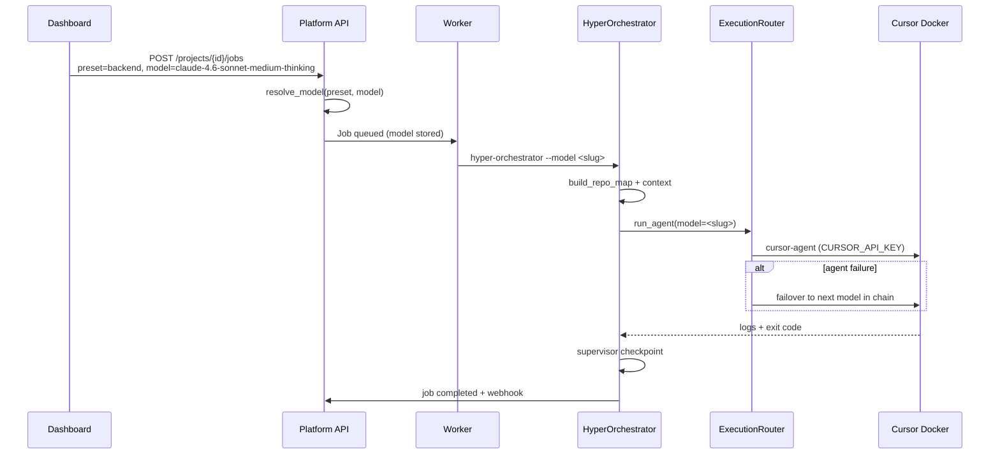

# HyperOrchestrator — Multi-Agent Implementation Plan

**Version:** 1.0  
**Date:** 7 June 2026  
**Status:** Phase 0 in progress  
**Reference:** [ARCHITECTURE_MULTI_AGENT.md](./ARCHITECTURE_MULTI_AGENT.md)

---

## 1. Executive Summary

HyperOrchestrator is evolving from a single-agent Docker runner into an **enterprise multi-agent control plane**. Phase 0 delivers per-preset model routing, job-level model selection, execution failover, lightweight repo maps, and dashboard UX — all through **Cursor agent containers** authenticated via `CURSOR_API_KEY`.

**Critical billing truth:** All Phase 0 coding runs through `cursor-agent` in Docker. Models listed in `MODEL_REGISTRY` are **Cursor agent slugs** (Composer + API-tier models exposed by Cursor). There is **no direct Anthropic API integration** in Phase 0. External Anthropic/OpenAI API keys are deferred to Phase 1+ unless explicitly needed as a failover path.

---

## 2. The 15 Agencies

Each agency is a bounded role in the multi-agent system. Phase 0 implements agencies 1–10 and scaffolds 11–15.

| # | Agency | Role | Phase 0 status |
|---|--------|------|----------------|
| 1 | **Control Plane** | backclub.it dashboard — trigger tasks, view jobs | ✅ Dashboard model picker, preset cards |
| 2 | **Platform API** | FastAPI :8000 — projects, jobs, presets, models | ✅ `GET /models`, `POST /projects/{id}/jobs` + `model` |
| 3 | **Job Worker** | Polls queue, spawns CLI subprocess per job | ✅ Passes `--model` from `jobs.model` column |
| 4 | **HyperOrchestrator** | Clone → analyze → agent → test → push | ✅ Uses `ExecutionRouter`, repo map in context |
| 5 | **Execution Router** | Model failover chain on agent failure | ✅ `core/execution_router.py` wired in orchestrator |
| 6 | **Cursor Agent** | Docker `cursor-agent` — sole coding executor | ✅ `DockerController.run_agent` + `CURSOR_API_KEY` |
| 7 | **Preset: General** | Full-stack balanced agent | ✅ Default `composer-2.5` |
| 8 | **Preset: UX** | UI/design specialist | ✅ Default `composer-2.5`, lint strategy |
| 9 | **Preset: Backend** | API/data layer specialist | ✅ Default `claude-4.6-sonnet-medium-thinking` |
| 10 | **Preset: Bugfix** | Surgical root-cause fixes | ✅ Default `claude-4-sonnet`, strict mode |
| 11 | **Repo Map** | Structured repo summary for context | ✅ In-memory cache (`core/repo_map.py`) |
| 12 | **Context Builder** | Truncate + prioritize context for prompts | ✅ Includes repo map excerpt |
| 13 | **Supervisor** | Cross-run checkpoint + next-step hints | 🔶 Scaffold (`core/supervisor.py`) |
| 14 | **Bug Bot** | Pre-merge diff review | ⬜ Phase 3 |
| 15 | **PRO Decomposer** | OpenAI multi-step task planning | ✅ Existing (PRO level only) |

---

## 3. Model Strategy — CURSOR_API_KEY

### 3.1 How models work in Phase 0

```
User selects model in dashboard
  → POST /projects/{id}/jobs { preset, model }
  → Worker: hyper-orchestrator --model <slug>
  → HyperOrchestrator.resolve_model(preset, override)
  → ExecutionRouter.run_agent(model=<slug>)
  → DockerController.run_agent (cursor-agent container)
  → CURSOR_API_KEY from agent.env / deploy script
```

All agent invocations require `CURSOR_API_KEY`. Setup:

```bash
./deploy/setup-cursor-api-key.sh   # writes to agent.env
# OR set in /opt/agent-orchestrator/config/agent.env
# OR set CURSOR_API_KEY in /opt/orch-cloud/.env
```

### 3.2 MODEL_REGISTRY tiers

| Tier | Billing | Examples | Provider |
|------|---------|----------|----------|
| `composer` | Included in Cursor plan | `composer-2.5` | Cursor |
| `api` | API credits via Cursor | `claude-4-sonnet`, `claude-4.6-sonnet-medium-thinking`, `gpt-5.3-codex` | Cursor-routed (not direct API) |

Preset defaults (`core/presets/registry.py`):

| Preset | Default model |
|--------|---------------|
| general | `composer-2.5` |
| ux | `composer-2.5` |
| backend | `claude-4.6-sonnet-medium-thinking` |
| bugfix | `claude-4-sonnet` |

### 3.3 Failover chain

When an agent run fails, `ExecutionRouter` tries the next model:

```
initial_model → claude-4.6-sonnet → composer-2.5 → auto
```

Switches are logged as structured `model_switch` events and recorded in supervisor checkpoints. **No Anthropic API fallback** — failover stays within Cursor agent slugs.

### 3.4 What Phase 0 does NOT do

- No `ANTHROPIC_API_KEY` / direct Anthropic API adapter
- No usage-based Anthropic billing or budget caps
- OpenAI used **only** for PRO-level decomposition (`OPENAI_API_KEY`)

---

## 4. Phase 0 — Weekend MVP (current)

**Goal:** Per-preset model routing, job-level override, failover, repo map in context, dashboard UX.

| Component | File(s) | Status |
|-----------|---------|--------|
| Model registry + API | `registry.py`, `routers/models.py` | ✅ |
| Job model column + migration | `server/models.py`, `database.py` | ✅ |
| CLI `--model` + worker pass-through | `core/main.py`, `worker.py` | ✅ |
| Execution router | `execution_router.py` → orchestrator | ✅ |
| Repo map (cache) | `repo_map.py`, `context_builder.py` | ✅ |
| Supervisor scaffold | `supervisor.py` (checkpoints) | ✅ |
| Dashboard model picker | `TriggerTaskModal`, `models.ts` | ✅ |
| Tests | `test_model_routing`, `test_execution_router`, `test_repo_map` | ✅ |

**API:** `GET /models`, `GET /presets` (+ `default_model`), `POST /projects/{id}/jobs` with optional `model`.

**Env:** `CURSOR_API_KEY` (required for agents), `OPENAI_API_KEY` (PRO only), `AGENT_MODEL_DEFAULT` (optional).

---

## 5. Phase 1 — Persistent Repo Maps

**Goal:** Eliminate full-scan-per-run; -60% input tokens on context.

| Deliverable | Detail |
|-------------|--------|
| `RepoMapService` | build, load, incremental refresh |
| Storage | `.hyper-orchestrator/maps/{project_key}/map.json` |
| Python analyzer | Django, FastAPI, Flask detection |
| API | `GET/POST /projects/{id}/maps` |
| Orchestrator | `_analyze_project()` → `load_map_or_build()` |
| Claude API option | `ClaudeCodingExecutor` adapter (opt-in via `claude_dev` flag) |

**Anthropic enters here:** Only if `Project.settings.execution.claude_dev=true` and `ANTHROPIC_API_KEY` is set. Default remains Cursor.

**Estimate:** 1–2 weeks.

---

## 6. Phase 2 — Main Supervisor Agent

**Goal:** Cross-project monitoring, review, auto-spawn fix tasks.

| Deliverable | Detail |
|-------------|--------|
| `SupervisorService` | Daemon/cron (5 min cycle) |
| Cross-project context | Per-project summary cards (≤500 tokens each) |
| Actions | Warn, review diff, auto-spawn bugfix job |
| Webhook events | `supervisor.alert` to backclub.it |
| Pre-push validation | Async review post COMPLETED |

Hard rules (non-LLM): diff > 500 LOC → review required; `tests_skipped` → never auto-merge.

**Estimate:** 2 weeks.

---

## 7. Data Flow (Phase 0)



---

## 8. Testing

```bash
pytest tests/                   # full suite
cd dashboard && npm run build # TypeScript + Next.js
```

Key files: `test_model_routing.py`, `test_execution_router.py`, `test_repo_map.py`, `test_presets.py`.

---

## 9. Gaps → Phase 1+

| Gap | Phase |
|-----|-------|
| Persistent repo maps, Python analyzer | 1 |
| Claude API direct coding (opt-in) | 1 |
| Budget caps / spend tracking | 1 |
| Supervisor daemon | 2 |
| Bug Bot + merge gates | 3 |
| backclub.it control plane | 4 |
| Postgres (from SQLite) | Before Phase 2 |

---

## 10. Decision Log

| Decision | Choice |
|----------|--------|
| Phase 0 execution | Cursor-only via `CURSOR_API_KEY` |
| Failover | In-chain Cursor slugs only — no external Anthropic API |
| Repo map | In-memory cache first; persist in Phase 1 |
| Dashboard fallback | `FALLBACK_MODELS` mirrors `MODEL_REGISTRY` |
